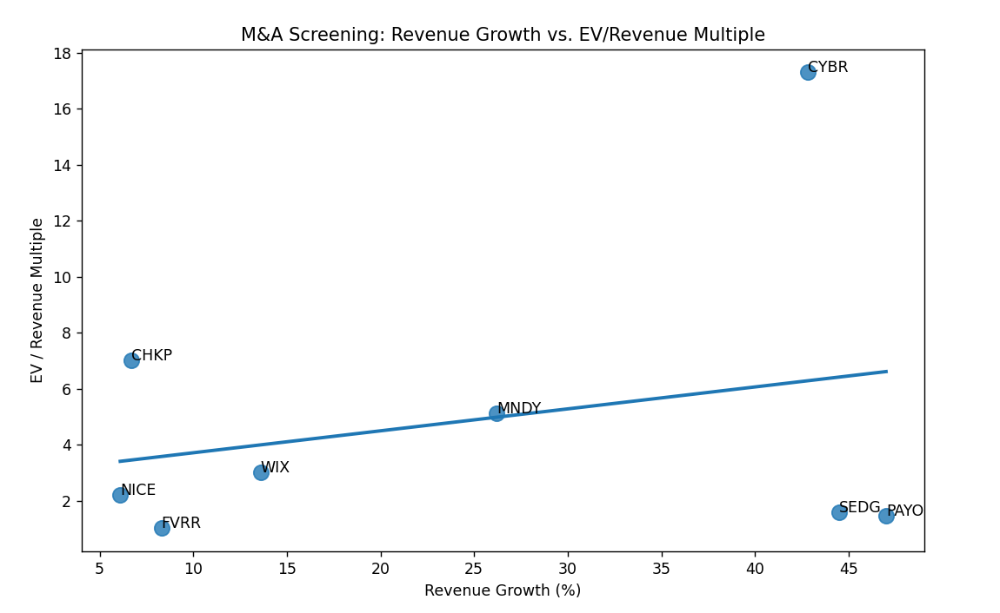
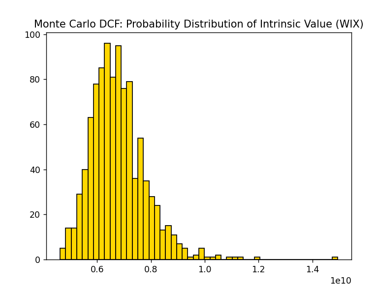

# M&A Valuation Screener: Israeli Tech Companies

**Emad Khaled** - CS & Statistics student, Tel Aviv University  
2024

---

## Why This Project?

2024 was a record year for Israeli tech M&A - over $13 billion in deals, including Salesforce buying Own for $1.9B and Nvidia acquiring Run:ai for $700M ! I kept seeing headlines about these acquisitions and wondered: how do investors actually identify which companies are good acquisition targets? and what does this mean ?

so I built a simple screening tool to find potentially undervalued Israeli tech companies using the same methods investment banks use : the  comparable company analysis and DCF valuation.

this is a small project but it touches on real finance concepts that I wanted to understand better with my heavy statistical background.

---

## What It Does

### 1. Pulls Real Financial Data
Automatically fetches live data from Yahoo Finance for 8 NASDAQ-listed Israeli tech companies:
- Monday.com (MNDY)
- Wix (WIX)
- Fiverr (FVRR)
- Check Point (CHKP)
- CyberArk (CYBR)
- NICE Systems (NICE)
- SolarEdge (SEDG)
- Payoneer (PAYO)

### 2. Identifies Undervalued Companies



The scatter plot shows Revenue Growth vs. EV/Revenue multiple. The regression line represents "fair value" - companies below the line might be undervalued relative to their growth.

**Key findings:**
- **SEDG and PAYO** sit in the bottom-right (high growth , low multiple) : potential M&A targets
- **CYBR** trades at a premium (17x revenue) : probably due to the "cybersecurity premium"
- **CHKP** also commands high multiples despite lower growth ( stable recurring revenue )

### 3. Monte Carlo DCF Valuation



Ran 1,000 simulations varying the discount rate (WACC) to get a probability distribution of intrinsic values for WIX.

The histogram shows most likely valuations cluster around $6.5-7.5 billion, which helps quantify the "margin of safety" when considering an investment.

---

## Technical Details


---

## Tech Stack

- **Python** : pandas , numpy , matplotlib, seaborn , scikit-learn
- **yfinance** : real time financial data
- **Finance concepts** : DCF, WACC, EV/Revenue multiples , comparable company analysis

---

## Project Structure

```
ma-screener/
├── ma_project.py           # Main analysis script
├── MA_Screener.xlsx        # Exported data
├── requirements.txt        
├── screenshots/
│   ├── 01_ma_opportunity_map.png
│   └── 02_monte_carlo_dcf.png
└── README.md
```

---

## Limitations

This is a simplified model - real M&A analysis would include:
- Detailed financial statement analysis
- Industry-specific multiples
- Synergy valuations
- Due diligence factors
- More sophisticated DCF with projected cash flows

But for a quick screening tool to identify potential targets, this works pretty well.

---

## How to Run

```bash
pip install -r requirements.txt
python ma_project.py
```

---

## What I Learned

- I learned how to pull financial data programmatically with yfinance
- the logic behind comparable company analysis (why growth justifies higher multiples)
- exercised Monte Carlo simulation for handling uncertainty in valuations
- Why certain sectors (like cybersecurity) command premium valuations

---

## Sources

- Financial data: Yahoo Finance API via yfinance
- M&A context: [Israeli tech M&A hits record $13.4B in 2024](https://www.timesofisrael.com/israels-tech-paradox-despite-war-tech-exits-surge-78-led-by-cyber-and-ai-deals/)
